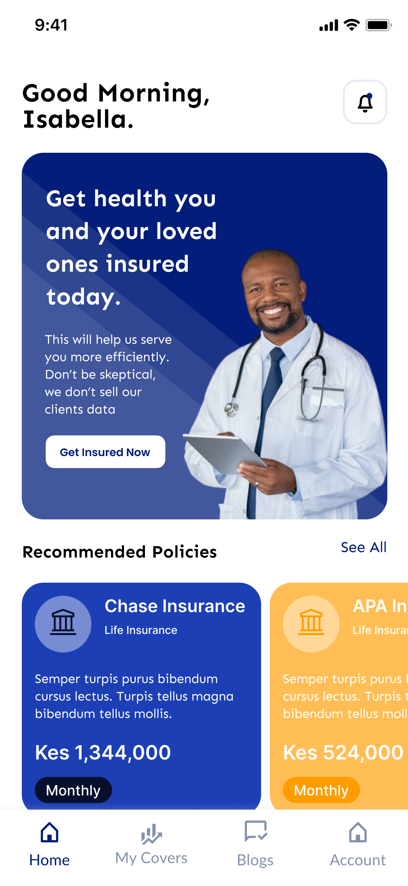

# Finafya 

Finafya is revolutionizing the way we consume healthcare by providing access when you need it , wherever you need it and however you need it.

🔗 Live App: [App](https://github.com/Xlroo/Finafya.git)

📖 Final Project Blog: [Blog](https://medium.com/@vbaraza.vb/finafya-is-a-digital-insurance-solution-designed-to-make-healthcare-accessible-to-everyone-f1bef128b0dc)

👥 Authors:[Victor Baraza](https://www.linkedin.com/in/victor-kenneth-baraza/)


## Installation

Install my-project with Android installer

```bash
  Go to settings 
  Allow from unknown sources 
  Download the apk 
  Install 
```
    
## Usage/Examples

```android
Sign Up 
```




```android
Browse Packages 
```


```android 
Purchase a package 
```


## Contributing

Contributions are always welcome!

See `contributing.md` for ways to get started.

Please adhere to this project's `code of conduct`.


## Related

Here are some related projects

[Awesome README](https://github.com/matiassingers/awesome-readme)


## License

[MIT](https://choosealicense.com/licenses/mit/)


## Acknowledgements

 - [ALX](https://awesomeopensource.com/project/elangosundar/awesome-README-templates)
 - [Awesome README](https://github.com/matiassingers/awesome-readme)
 - [How to write a Good readme](https://bulldogjob.com/news/449-how-to-write-a-good-readme-for-your-github-project)

